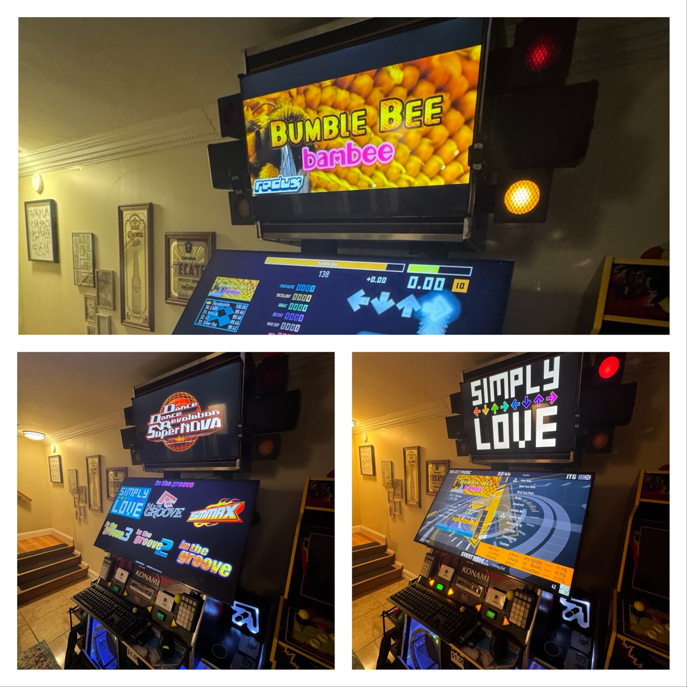

# Plan

## arcade_station Overview
arcade_station is a front-end interface for managing and interacting with the games you love.

### Motivation
The motivation behind this project is a desire to recreate the [ddr-picker](https://github.com/dtammam/ddr-picker) project from scratch so that the larger rhythm-game community can easily use it for any of their needs. This has been a passion project since I first saw [evan clue's version](https://github.com/evanclue/ddr-picker) - it inspired me to make it my own by refactoring it in PowerShell and by adding tons of new features. Now, I'm off to do it again - by the end, it'll provide the best of the ddr-picker experience while having a seamless install experience for those not technically savvy.

### Language(s)
- The primary language that will be used for this project will be Python:
    - It's compatible with Windows, Linux and Mac
    - It's got a rich set of libraries that will allow me to extend functionality
    - It's a tried and true, battle-tested language
    - Getting more hands-on, real-world experience with Python is a personal skill development
- If any lower-level interactions are needed, I will sparingly opt for the built-in OS' scripting language (PowerShell and Bash).

### Analyze Existing Code
#### Application Dependencies:
| Application                                   | Purpose                                                                       | Windows | Linux | Mac |
|-----------------------------------------------|-------------------------------------------------------------------------------|---------|-------|-----|
| pegasus-fe                                    | Frontend interface for displaying the games                                   | 🪟      | 🐧    | 🍏  |
| MAME                                          | Emulator for arcade games                                                     | 🪟      | 🐧    | 🍏  |
| ITGMania                                      | Dance game simulator for the project (core version without songs)             | 🪟      | 🐧    | 🍏  |
| Irfanview                                     | Programmatically launchable image viewer                                      | 🪟      | ❌    | ❌  |
| AudioSwitcher                                 | OSD for volume when `explorer.exe` isn't the shell                            | 🪟      | ❌    | ❌  |
| Spicy Nuggets                                 | Software for managing overall experience                                      | 🪟      | ❌    | ❌  |
| OBS Studio                                    | Free and open source software for video recording and live streaming          | 🪟      | 🐧    | 🍏  |
| Litboard (`mame2lit.exe`, `LightsTest.exe`)   | Enables clean resetting of litboard lights                                    | 🪟      | 🐧    | ❌  |
| iCloud                                        | Apple sync client for photo uploads (considering alternative cloud solutions) | 🪟      | ❌    | 🍏  |

#### File Dependencies:
- assets: Locally stored .png files for game icons.
- Grid Micro theme for Pegasus: Specific theme supporting the optimized frontend's design.

#### System Dependencies:
- (To be validated) Local administrative privileges
- Ability to auto-logon
- User interface in exclusive mode

### Plan the Transition Strategy
### Phase 1: Core logic and scaffolding in Python
- Migrate and refactor the `core_functions.psm1` module. Really knock out the base library that will be used by this project
- Recreate all base PowerShell scripts in Python for the core functionality (killing Pegasus, launching games, taking pics)
- Recreate the listener AutoIt scripts in Python and add to startup (reference the `keyboard` library)
This phase is complete when all initial functionality with all Windows dependencies working with a full Python codebase.

### Phase 2: Novel cross-platform solution implementations
- Implement cross-platform solutions for elements without native cross-platform support
This phase is complete when all functionality with all dependencies are solved for and functionality has been proven on Windows, Linux and Mac.

### Phase 3: User installer creation
- Create an installer
This phase is complete when a user can take the installer, run it on their Windows/Linux/Mac machine and have a functional arcade_station setup.

### Phase 4: Ongoing optionality
- Create additional support for flexible options (File sync clients, multiple versions of the game, extended options for streaming, etc.)

### Implement Translation
| Function Needed      | Proposed Solution                                                | Reasoning                                                                                                    |
|----------------------|------------------------------------------------------------------|--------------------------------------------------------------------------------------------------------------|
| Core module/library  | Refactor existing library, incorporate popular public libraries  | Will plan to use original logic within `CoreModules.psd1` in a new `CoreModules.py` and extend as required   |
| Image viewer         | Create a custom `framelesswindow` module                         | Irfanview is not available on Linux and Mac, create a solution with Python                                   |
| Volume OSD           | Continue using Volume OSD for Windows                            | Windows-specific problem. Plan to keep for Windows and not to kill the shell with Mac/Linux                  |
| Spicy nuggets        | Spicy nuggets limited to Windows only                            | Certain spicy launchers appear to be Windows compatible only (even after 573 attempts)                       |
| Litboard support     | Ensure `mame2lit.exe` and `LightsTest.exe` work on Linux and Mac | These tools are currently not *obviously* supported on Mac, but it might be. Will find out.                  |
| iCloud               | iCloud is Windows/Mac only.                                      | iCloud is not available on Linux, will plan to abstract in Phase 4 for any number of solutions to work       |

### Testing and Validation Strategy

#### Test Environments
1. Production Testing
    - Physical arcade cabinet hardware validation
    - Community beta testing program for real-world validation
    
2. Development Testing
    - Virtual machine validation for all platforms
        - Windows: Clean Windows 10/11 installations
        - Linux: [TJ's ITG System Image](https://docs.google.com/document/d/1_lO2ddaYogve08u7CsjC6OojXy36ZfGgo7VCRVkLJhU/edit?tab=t.0#heading=h.f4j4mmoacz4) and clean Ubuntu LTS

#### Testing Framework
- Implementation of pytest for unit and integration testing
    - Integration tests for cross-platform compatibility
    - `pytest` for module/functional testing with GitHub actions
    - Ad-hoc creation of tests for failure modes as code is written

### Code Maintenance and Documentation
#### Development Standards
1. Code Quality
    - Follow Python best practices and style guidelines (`PEP 8`) and (reference [Google's python's guidelines](https://google.github.io/styleguide/pyguide.html)) to enable automatic code documentation by MKDocs
    - Implement modular, well-functionalized code architecture
    - Leverage existing libraries where appropriate rather than custom implementations
    - Include comprehensive unit tests and integration tests

2. Documentation
    - Maintain detailed docstrings with meaningful examples (reference [Google's python's guidelines](https://google.github.io/styleguide/pyguide.html))

3. Repository Management
    - Plan to develop in public as I go
    - Include setup and contribution guidelines after reaching Phase 4 (validate adherence for license adoption before accepting first MR)

4. Configuration Management
    - Implement configuration via external files for flexibility
    - Use TOML (`.toml`) as the standard configuration format and leverage `tomllib` for parsing and managing configurations

5. Packaging Requirements
    - Simple installer created with something like `py2app`
    - Initial installation requiring little to no configuration
    - Post-install, use a secondary `getting-started` thin app that is platform specific

#### Technical Specifications
1. Environment
    - Python Version: [3.12.8](https://www.python.org/downloads/release/python-3128/)
    - Dependency Management: `venv` with explicit `requirements.txt`, pin to <= major/minor versions of dependencies used in development (choosing not to use `pyproject.toml` as I am looking to ease into this)
    - UI Framework: `tkinter` for installer interface

2. Project Structure
    - Modular package organization
    - Clear separation of concerns
    - Configuration-driven architecture

3. Packaging Design
    - Compiled binary to install once ready leveraging `py2app`
        - NSIS for Windows
        - .pkg for Mac
        - Nothing for Linux
    - Deploy with GitHub Releases

#### Contribution Guidelines
- Open for community contributions after Phase 4
- Mandatory code review process
- Required test coverage for new features
- Adherence to established coding standards

### Stakeholder Communication
Updates will be shared with the [DDR + ITG Players](https://www.facebook.com/groups/565890830137096/) and [Private Dance Games Arcade Owner (ITG, DDR, PIU, TechnoMotion)](https://www.facebook.com/groups/180601838781725) Facebook groups as the project progresses.

### Reflect on the Process
*To be done as the project progresses*

### Manage Risks and Setbacks
*To be determined*