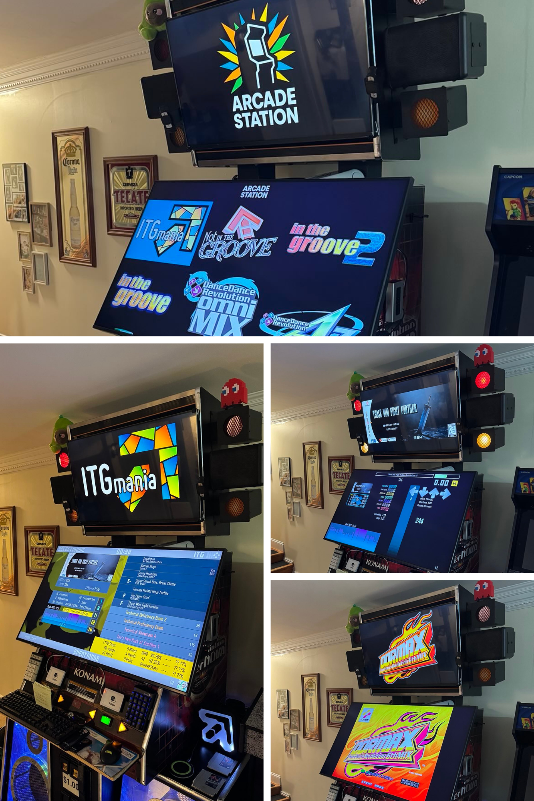

# Arcade Station

   

<h2 align="center">Arcade Station is a front-end interface for managing and interacting with the games you love.</h2>

   

## Table of Contents
- [✨ Features](#features)
- [🎯 Goals](#goals)
- [📋 Requirements](#requirements)
- [💾 Installation](#installation)
- [🎮 Walkthroughs](#walkthroughs)
- [🐛 Known Issues](#known-issues)
- [⚖️ License](#license)
- [🙏 Acknowledgments](#acknowledgments)

## ✨ Features

- Cross-platform core functionality (Windows, Linux, and macOS)
- Easy-to-use installation wizard (Windows installer in this release)
- Game configuration for ITGMania, binary games, and MAME

## 🎯 Goals

This project was born from several personal and professional development goals:

- **Gain experience as a software developer** - Building a complete application from concept to deployment
- **Learn AI-assisted programming** - Exploring how to effectively collaborate with AI as a development partner
- **Practice DevOps principles** - Implementing modern software development practices and workflows
- **Create something modern and modular** - Building a user-friendly solution that non-technical people can easily use
- **Have fun** - Enjoying the process of creating something meaningful for myself and the arcade gaming community

## 📋 Requirements

### 💻 Technical
- [Python 3.12.9](https://www.python.org/downloads/release/python-3129/)
- Windows 10/11 (current release)
- Administrator privileges for installation
- 500MB free disk space

### 🔒 Kiosk Mode and UAC
Arcade Station is primarily intended for use in dedicated, modern arcade cabinets, where a seamless kiosk-like experience is expected. In such cases, system-level operations - such as replacing the Windows shell, executing PowerShell scripts, and managing background processes - may be disrupted by User Account Control (UAC):

- For this reason, disabling UAC may be considered in tightly controlled kiosk environments. 
- However, this should only be done with compensating security measures in place (e.g., restricted physical and network access).
- Disabling UAC is not recommended for general-purpose computers or setups not operating in kiosk mode. 

This recommendation is not made lightly, and future releases aim to improve compatibility and reduce reliance on this configuration.

## 💾 Installation

### ℹ️ Platform Support
**Note:** While the core codebase is cross-platform, this initial release focuses on Windows installation. Mac and Linux installers are in development and will be available soon.

### 🪟 (Windows - Current Release)

1. Download and install [Python 3.12.9](https://www.python.org/downloads/release/python-3129/). *You must select install as Admin and add to PATH options!*

   

2. If intending on using this with kiosk mode, disable UAC. 
3. Download Arcade Station by cloning the repo or by clicking `Code/Download ZIP`

   

4. Right-click and run `install_arcade_station.bat` from the cloned repo/extracted .zip as Administrator. If warned about Windows protecting your PC, select more options and `Run anyway`.

   

5. Go through the setup, starting by choosing where you'd want the program installed. For detailed walkthroughs, see the [Laptop Setup Guide](examples/LAPTOP.md) or [DDR Cabinet Setup Guide](examples/DDR.md).

6. Once installation is complete, the location you installed arcade station in will open in Windows Explorer.

7. Run `launch_arcade_station.bat`. The launcher will automatically unblock all files to prevent security warnings.

Congrats, you're setup! Whenever you want to start Arcade Station. Re-run `install_arcade_station.bat` and point to your install directory to reconfigure it.

## 🎮 Walkthroughs

For detailed walkthroughs with examples showing complete installation and usage flows:

- **[🎮 Laptop Setup Guide](examples/LAPTOP.md)** - Portable multi-monitor setup using a Surface Laptop Studio with external displays, configuring ITGmania and Megatouch Maxx, and demonstrating dynamic marquee functionality
- **[🕺 DDR Cabinet Setup Guide](examples/DDR.md)** - Dedicated DDR cabinet configuration with rhythm games including ITGmania, ITG2, OpenITG, and MAME-based 573 games, plus advanced features like kiosk mode and reconfiguration

## 🐛 Known Issues

- When reconfiguring an existing installation, your config may not save properly if you navigate back and forth between pages. This will be fixed in an upcoming release.

These issues are being actively investigated and will be fixed in an upcoming update.

## ⚖️ License

**Arcade Station** is Free and Open Source Software (FOSS).
This project is licensed under the GNU General Public License v3.0 - see the [LICENSE](LICENSE) file for details.
This project incorporates several third-party components. See [NOTICE](NOTICE) for detailed attribution and licensing information.

## 🙏 Acknowledgments

Please reference the [THANKS](THANKS.md) file.

This is a free and open-source project - no payment is expected. But if you've found it helpful and want to show support, you're welcome to do so here: [Ko-Fi](https://ko-fi.com/dtammam) ☕