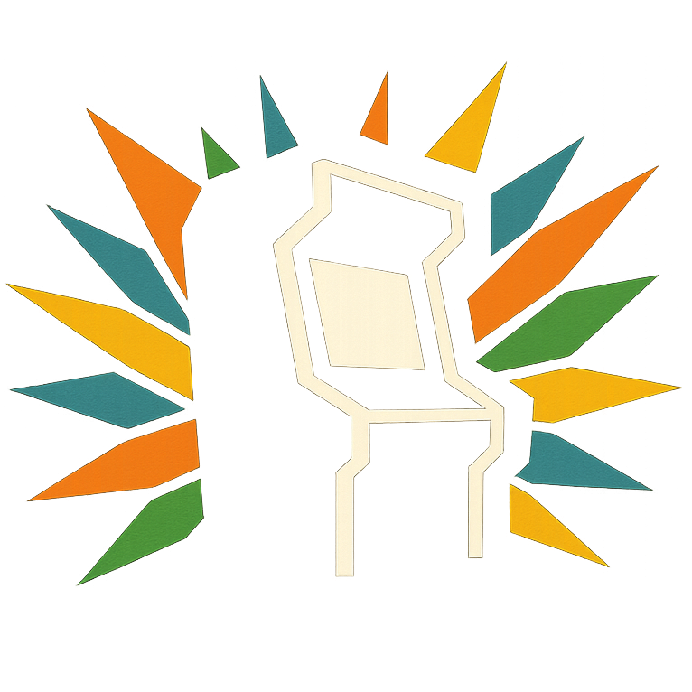
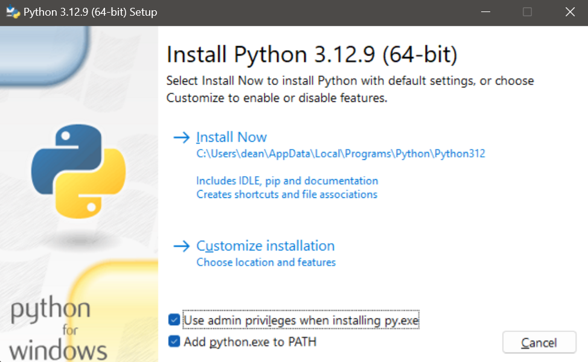
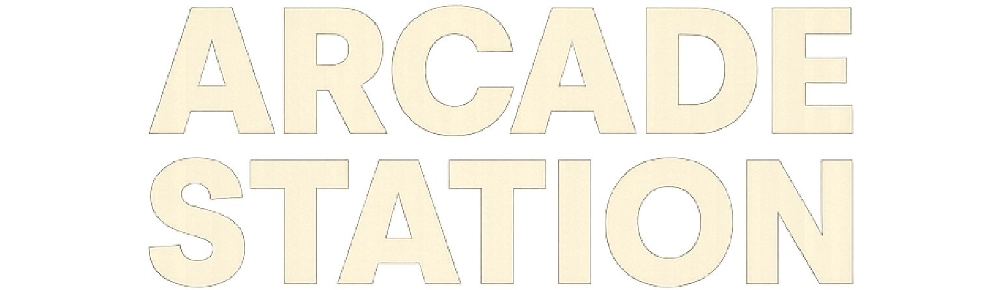

# Arcade Station Installer

arcade station is a front-end interface for managing and interacting with the games you love.
*While the core codebase supports Windows, Linux, and macOS, this MVP release provides a streamlined Windows installation experience. Support for Mac and Linux installers will be available in upcoming releases.*

## Features

- Cross-platform core functionality (Windows, Linux, and macOS)
- Easy-to-use installation wizard (Windows installer in this release)
- Game configuration for ITGMania, binary games, and MAME
- Control device configuration (arcade controls, gamepads, and keyboard)
- Cabinet lighting setup for RGB LED integration
- System utilities and maintenance tools

## Installation

### Quick Start (Windows - Current Release)

1. Download and install Python 3.12.9 (what this was built and tested on). Here's the [download link](https://www.python.org/downloads/release/python-3129/). When asked, explicitly install as Admin and add to PATH (or the rest of the app won't work.)

2. Download the zip of this branch `arcade_station-feature-simple-installer`, keeping all content in one folder.
3. Run `install_arcade_station.bat` If warned about Windows proecting your PC, select more options and `Run anyway`.

4. Follow the installation wizard to configure your setup
5. Once installation is complete, navigate to the installation directory you chose. Congrats, you're setup!
6. Launch `launch_arcade_station.bat` whenever you want to start Arcade Station. Re-run `install_arcade_station.bat` and point to this directory to reconfigure it.
You may also see a security warning similar to the first and will need to `Run anyway` for the first time you launch it.

**Note:** While the core codebase is cross-platform, this initial release focuses on Windows installation. Mac and Linux installers are in development and will be available soon.

### Requirements

[Python 3.12.9](https://www.python.org/downloads/release/python-3129/).

## License

This project is licensed under the GNU General Public License v3.0 - see the [LICENSE](LICENSE) file for details.

### Third-Party Components

This project incorporates several third-party components. See [NOTICE](NOTICE) for detailed attribution and licensing information.

## Credits

- This guy 👉🏼😉👈🏼
- The current state of generative AI (most specifically, ChatGPT, Cursor, Anthropic's Claude 3.7 with thinking - Jesus Christ, did that make this possible). Deepseek R1 for helping me come up with a framework to use for [planning this effort](PLAN.md)
- clue for the original [ddr-picker](https://github.com/evanclue/ddr-picker) which inspired my [PowerShell rewritten fork](https://github.com/dtammam/ddr-picker) and ongoing developments which led to Arcade Station
- also clue for the awesome art assets
- My friend JMK for being a constant source of inspiration
- din and teej for being awesome about sharing ideas, recommendations, feedback for things like ITGmania compatible modules, art, user experience considerations, STAC board firmware and lights reset utilities
- Ashley Philbrick for listening to me ramble about progress on an endless to-do list for the last few months anbd providing encouragement
- Pegasus-fe and the Discord community for answering my questions about QML formatting and why their thing worked
- Last but not least, Marcy and Daisy for putting up with me programming furiously without knowing what it was about but trusting me when I said it was cool and important