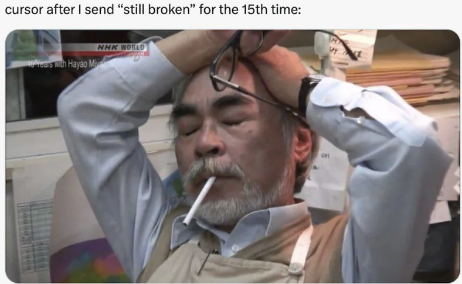
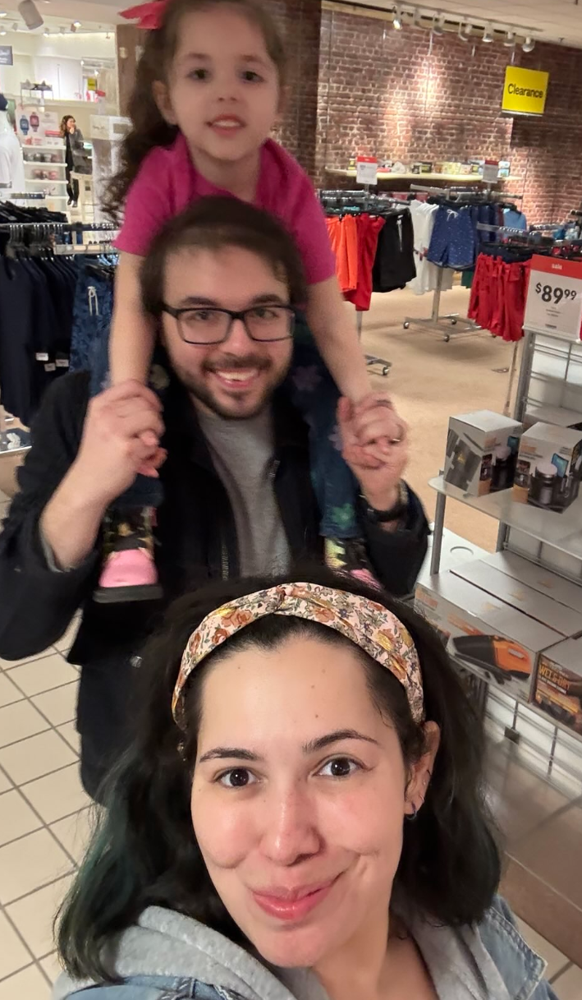

THANKS

- [Me](https://github.com/dtammam) 👉🏼😉👈🏼
- The current state of generative AI from 2024-2025. To be specific,
    - Cursor, and Anthropic's Claude 3.7 with thinking - Jesus Christ, did that make this possible

        
    - ChatGPT for endless "phone calls" from the car to learn what certain things are and how they work
    -  Deepseek R1 for helping me come up with a framework to use for [planning this effort](PLAN.md)

- [clue](https://clue.media) for the original [ddr-picker](https://github.com/evanclue/ddr-picker) which inspired my [PowerShell rewritten fork](https://github.com/dtammam/ddr-picker) and ongoing developments which led to Arcade Station. Also - the awesome art assets!!
- [din](https://github.com/dinsfire64) and [teejusb](https://github.com/teejusb) for being awesome about sharing ideas, recommendations, feedback for things like [ITGmania](https://www.itgmania.com) compatible modules, art, user experience considerations, STAC board firmware and lights reset utilities
- [Ashley Philbrick](https://mysticsteps.com) for listening to me ramble about progress on an endless to-do list for the last few months and providing encouragement
- The [Pegasus project](https://pegasus-frontend.org) and their Discord community for answering my questions about QML formatting and why their thing worked
- The following friends for constant sources of inspiration, triangulation, meaningful feedback, testing, or generally just listening to me talk about this thing
    - Tedmond L.
    - Julian K.
    - Joe D. 
    - Harpreet S.
    - Jesse T.
    - Mike M.
    - Preston S.
    - Piry
    - Eric Z.
    - Trent

- Last but not least, Marcy and Daisy for putting up with me programming furiously without knowing what it was about but trusting me when I said it was cool and important

    

