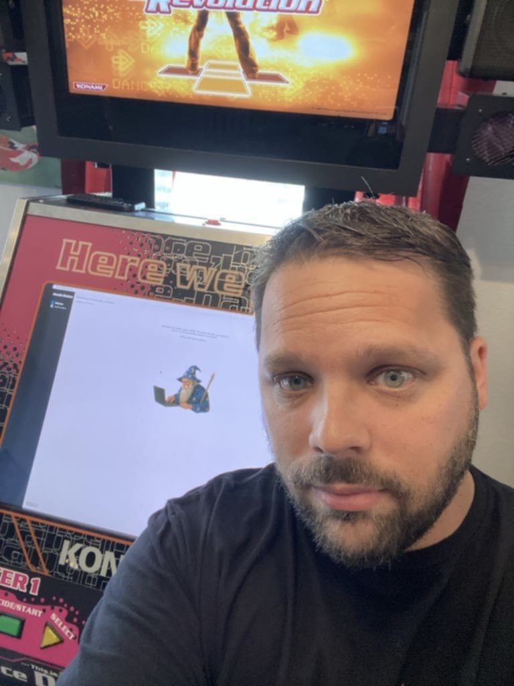

# 🙏 Acknowledgments

## Table of Contents
- [👨‍💻 Creator](#creator)
- [🤖 AI & Technology](#ai--technology)
- [🎮 Game Development Community](#game-development-community)
- [👥 Friends & Testers](#friends--testers)
- [👨‍👩‍👧 Family](#family)

## 👨‍💻 Creator

- [Me](https://github.com/dtammam) 👉🏼😉👈🏼, circa early 2025

## 🤖 AI & Technology

The current state of generative AI from 2024-2025 made this project possible:

- **Cursor** and **Anthropic's Claude 3.7 with thinking** - Jesus Christ, did that make this possible

- **ChatGPT** for endless "phone calls" from the car to learn what certain things are and how they work
- **Deepseek R1** for helping me come up with a framework to use for [planning this effort](PLAN.md)

## 🎮 Rhythm Game Community
- **[clue](https://clue.media)** for the original [ddr-picker](https://github.com/evanclue/ddr-picker) which inspired my [PowerShell rewritten fork](https://github.com/dtammam/ddr-picker) and ongoing developments which led to Arcade Station. Also - the awesome art assets!!
- **[din](https://github.com/dinsfire64)** and **[teejusb](https://github.com/teejusb)** for being awesome about sharing ideas, recommendations, feedback for things like [ITGmania](https://www.itgmania.com) compatible modules, art, user experience considerations, STAC board firmware and lights reset utilities
- **[Ashley Philbrick](https://mysticsteps.com)** for listening to me ramble about progress on an endless to-do list for the last few months and providing encouragement
- **The [Pegasus project](https://pegasus-frontend.org)** and their Discord community for answering my questions about QML formatting and why their thing worked

## 👥 Friends & Testers

The following friends provided constant sources of inspiration, triangulation, meaningful feedback, testing, or generally just listened to me talk about this thing:

- **Ray T.** for the test hardware (and for being my brother lol)

    

- **Stephen P.**, my first ever UAT tester who stress tested this on his cab and provided excellent feedback

    

- **topet**, my 2nd UAT tester who tested this on a laptop-based setup!
- **Tedmond L.**
- **Julian K.**
- **Joe D.**
- **Harpreet S.**
- **Jesse T.**
- **Mike M.**
- **Preston S.**
- **Piry**
- **Eric Z.**
- **Trent**
- **DeWitt G.**
- **Paul G.**
- **Chris R.**
- **Luis M.**
- **Dan G.**

## 👨‍👩‍👧 Family

Last but not least, **Marcy** and **Daisy** for putting up with me programming furiously without knowing what it was about but trusting me when I said it was cool and important.
