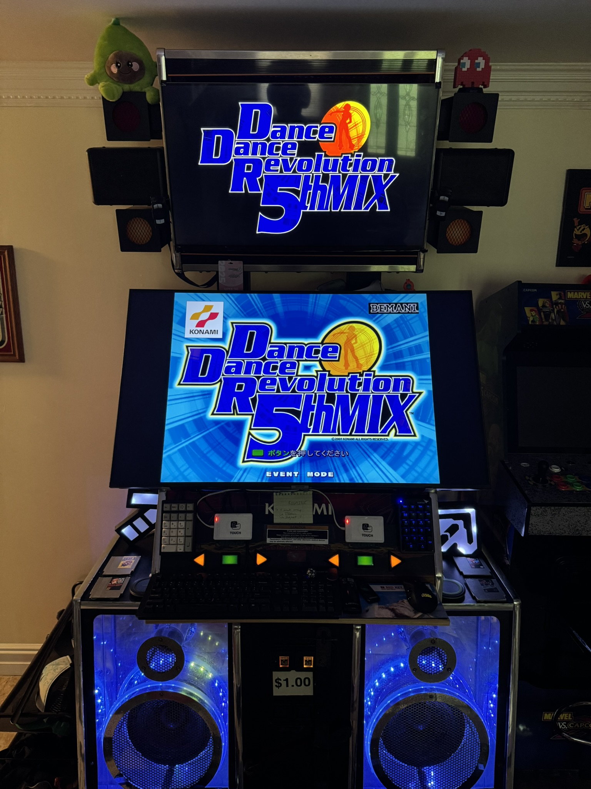

# 🕺 DDR Cabinet Setup Guide

## Table of Contents
- [🎮 DDR Cabinet Scenario](#ddr-cabinet-scenario)
- [🎯 MAME Configuration (Optional)](#mame-configuration-optional)
- [🔧 DDR Cabinet Installation Walkthrough](#ddr-cabinet-installation-walkthrough)
  - [🚀 Launching the Installer](#launching-the-installer)
  - [📁 Choosing Install Directory](#choosing-install-directory)
  - [🎵 Configuring ITGmania](#configuring-itgmania)
  - [💿 Configuring Binary-Based Games](#configuring-binary-based-games)
  - [🕹️ Configuring MAME](#configuring-mame)
  - [⌨️ Configuring Key Bindings and Processes](#configuring-key-bindings-and-processes)
  - [🖼️ Configuring Dynamic Marquee](#configuring-dynamic-marquee)
  - [🔒 Configuring Kiosk Mode](#configuring-kiosk-mode)
  - [🛠️ Configuring Utilities](#configuring-utilities)
  - [📋 Installation Summary](#installation-summary)
  - [🎮 Arcade Station First Launch](#arcade-station-first-launch)
  - [🧪 Testing ITGmania and Integrations](#testing-itgmania-and-integrations)
  - [✨ Dynamic Marquee Examples](#dynamic-marquee-examples)
  - [📸 Screenshot Example](#screenshot-example)
  - [💻 Going Back to PC Mode](#going-back-to-pc-mode)
- [🔄 Updating an Existing Arcade Station Setup](#updating-an-existing-arcade-station-setup)

### 🎮 DDR Cabinet Scenario
This guide will cover setting up Arcade Station on a dedicated DDR cabinet. This configuration will include:
- Installing Arcade Station and configuring rhythm games, including ITGmania, ITG2, OpenITG and some 573-based versions via MAME
- Reconfiguring an existing Arcade Station install to replace configured games and imagery
- Leveraging the dynamic marquee and ITGmania dynamic marquee integration to see song banner art when selected

### 🎯 MAME Configuration (Optional)
On MAME specifically,
- You can download it [here](https://drive.google.com/file/d/1MeW7KpsYcS2fmws7ZQG0OomuIFVHAcid/view?usp=sharing), [here](https://mega.nz/file/ICVRFJwI#ksriX9qHzXEdDwwjsqYv84MN1V43CSedjK8lEosV_7Y), or [here](https://archive.org/download/ddr573-mame/ddr573-mame.zip). 
- It includes:
    - A custom build of [bemani-mame](https://github.com/987123879113/mame/wiki)
    - Pre-built NVRAM for (almost) every game, negating the need to install each game manually
    - Save states that drop you right into the title screen of the game with event mode already enabled, skipping the lengthy boot process
    - All the game data you need to get it going
        - Once you have the MAME pack downloaded, you should extract it as-is (for this example, it'll be in `C:\Games\ddr-573`)

### 🔧 DDR Cabinet Installation Walkthrough

Let's go over where I am as I start this process:
- I'm standing in front of my DDR cabinet, logged in as the local Administrator, and have downloaded the latest version of Arcade Station.
- I've already got ITGmania installed, along with ITG2, OpenITG, ITG1, and MAME.
- It is a Windows-based PC, currently running Windows 11.
- It has two monitors connected to it and I'm using an external keyboard and mouse.

#### 🚀 Launching the Installer
1. I've disabled UAC by doing the following:
    1. Press `Windows Key` + `R`, type `UserAccountControlSettings`, and press `Enter`
    2. In the User Account Control Settings window, drag the slider to the bottom for the `Never notify` / `Never notify me when` option
    3. Select `OK`, then `Yes` to confirm
    4. Reboot your computer to fully apply the change
          

2. I've extracted the `arcade station` .zip file in my downloads.

    

3. I right-click `install_arcade_station.bat` and run it as Administrator.

    

4. The installer builds the virtual environment and will download all required dependencies. The window will close once finished and then launch the installer.

    

5. The installer opens with a friendly wizard here to guide the way! I select `Next` once ready.

    

#### 📁 Choosing Install Directory
6. I'm prompted to select an install directory, with the default being within the logged in user profile. I'll accept this default and select `Next`, and will then see the files copy.

    
    

7. I'm given an introduction to the context of the installer and the types of games that can be configured. Neat! I'll leave `I would like to configure games now` checked and select `Next`.

    

#### 🎵 Configuring ITGmania
8. I have ITGmania installed in the default location, and the installer detected it for me! It's also going to use the default image in the menu and enables the dynamic marquee integration for displaying the song asset on my 2nd monitor. Since I plan to use that later, I'll leave all of it set to default and select `Next`.

    

#### 💿 Configuring Binary-Based Games
9. I now see the binary game setup page, where .exe style games are added. I want to setup ITG2 and OpenITG. I'll select `Add Another Game` in the bottom to show a new game entry field.

    

10. Let's start with ITG2. I'll type `itg2` in the game name field.

    

11. For the executable, I'll select `Browse...`, and will find and select `OpenITG.exe` - the actual program that starts the game.

    

12. For the banner image, I'll select `Browse...` which opens the bundled image assets that came with Arcade Station! Inside of it includes a bunch of dance games for convenience. I'll find and select the banner for ITG2 and select `Open`.

    
    
    

13. ITG2 is all set. I'll now select `Add Another Game` again, and go through the same process for NotITG. Once done, I'll select `Next`.

    

#### 🕹️ Configuring MAME

14. I now see the MAME games setup page. We're leveraging the ddr-573 MAME setup mentioned earlier, so I'll use that context for configuring it here. 

    

15. I'll start by checking the box for `I want to use MAME games with Arcade Station` and will select `Browse`, picking `mame.exe` within the folder and selecting `Open`.

    

16. I'll now select `Browse` for the MAME INI directory, and choose the actual `ddr573-mame` folder, as it contains the mame.ini file.

    

17. Excellent, I can now add games. I'll select `Add Another MAME-Based Game` at the bottom.

    

18. I'd like to start with DDRMAX2. I'll type `ddr max 2` as the game name

    

19. For the ROM name, I'll input `ddrmax2`, as that's the name of the directory within `ddr573-mame\roms`.

    

20. For the save state... all games have been bundled with a save state that immediately kicks off in Event Mode at the start screen, bypassing the boot options. You can confirm the name of the save state in the `ddr5734-mame\sta\ddrmax2` folder (all are named similarly as `o`.)

    

21.  For the banner image, I'll select `Browse...`, will find and select the banner for DDRMAX2 and will select `Open`.
    
    
     

22. I'll rinse and repeat for DDRMAX and 5thMIX. selecting `Next` once done.

    

#### ⌨️ Configuring Key Bindings and Processes

23. I now see the Key Bindings Setup page. These show bundled scripts provided with Arcade Station that do things like reset back to the menu, take screenshots, or restart the computer. I'm actually okay with all of these defaults, but if I wanted to change them, I'd point to different scripts or reference [available keys for keybindings here](https://github.com/boppreh/keyboard/blob/master/README.md#api). 
     - The most important one will be `Reset back to menu`, which kills any open game or console and goes back to the main menu, which is triggered when pressing `ctrl` + `space` by default.
     - I also plan to use the `Take screenshot` buttons, which will require us to pick a place to save them - we'll do that later.

       

24. I select the `Process Management` tab in the ribbon to see all processes killed with the `Reset back to menu` script. If I added games unfamiliar to Arcade Station, I'd add the process names here so that they'd also be closed (otherwise, your game would remain open.) I'm okay with these defaults as I'm using initially accounted for games with ITG2, OpenITG and MAME, so I'll leave it as-is and select `Next`.

    

#### 🖼️ Configuring Dynamic Marquee

25. I now see the Display Configuration page, where I'll be able to configure the `Dynamic Marquee`, which is a digital replacement of the arcade cabinet art based on the selected game. I have two screens and want to do this, so I'll leave `Enable Dynamic Marquee` checked, and will select `Show Monitor Numbers` which will show which monitor is which. My second moniutor is showing up as `1`, so I'll select `1` in the dropdown and will select `Next`.

#### 🔒 Configuring Kiosk Mode

26. I now see the Kiosk Mode Configuration page, which will allow me to turn my machine into a `kiosk-mode` - it'll make it so that the machine immediately launches Arcade Station when the machine is powered on. I'll select `Enable Kiosk Mode` and will input my local username and password for autologin. I'll also make sure that `Replace Windows Explorer with Arcade Station` is checked.

    

#### 🛠️ Configuring Utilities

27. I now see the Utilities Setup page, which will allow me to configure things like lights management (for litboards or stacboards), setup a streaming button to launch OBS, setup a VPN client to autostart, add a volume OSD (since kiosk mode doesn't natively have one), or configure a location for screenshots. I'll go ahead and configure a combination of settings I need, which include a streaming button, a VPN to autostart, and screenshots being saved into a specific folder. After configuring the desired options, I'll select `Next`.

        
    

#### 📋 Installation Summary

28. I now see the Installation Summary page, which shows a recap of all selected options for final review. I'm ready for it to complete and will select `Finish`!

    

29. After a few moments, I'm shown a success message, which advises me to launch Arcade Station once before rebooting to fully setup kiosk mode. I'll select `OK`, and after another few moments, my Arcade Station install folder opens with a final success message, letting me know I'm good to go!

    
    

#### 🎮 Arcade Station First Launch

30. I'll right-click `launch_arcade_station.bat` in the window that just opened (my install of Arcade Station) and will run it as Administrator.

    

31. I'll see it launch, and show Arcade Station open with my dynamic marquee and all the configured games!

    

- Per the instructions, at this point, I will reboot to go into `Kiosk Mode`.

---

#### 🧪 Testing ITGmania and Integrations

32. I'll use the arrow keys to select it and press `Enter` to launch it - and would you look at that, the dynamic marquee changed to ITGmania!

    
    

33. In the game, I can pick a song, and once it's selected, the marquee will change to the banner art of the song! It will remain there until you get back to the song selection screen. Now friends can easily see what song you're playing from the marquee itself!

    
    
    

#### ✨ Dynamic Marquee Examples

34. I'm going back to the menu by presing `Ctrl` + `Space` and then open each game, so I can see what they look like, pressing `Ctrl` + `Space` to go back to the menu after each launch. They look cool!

    
    
    
    
    

#### 📸 Screenshot Example
35. For 5thMIX, I'll quickly test my screenshot function by pressing `/` - it saves to a folder which automatically uploads to my iCloud, and the screenshot looks crisp!

    
    

#### 💻 Going Back to PC Mode

36. This is great, but I'm thinking about reconfiguring my setup - I want to swap out some games. I'll go back to PC mode by pressing `ctrl` + `f2`.

### 🔄 Updating an Existing Arcade Station Setup

37. I'd like to update a few games and change my default banner image, now that I think about it. Now that I'm back in PC mode, I'll go back to the Arcade Station installer, launch it as Administrator... except this time, I'll choose to install on top of my existing install and will select `Yes` when prompted to reconfigure.

    

38. For the next two screens, I'll accept the defaults - not touching anything with my ITGmania setup, and I do totally plan to configure games.

    
    

39. For binary-based games... I don't want to have NotITG configured anymore... instead, I want ITG1. I'll select `Delete` next to notitg and will then select `Add Another Game`, going through the steps for configuring ITG1 as I have for the other games before.

    
    
    
    

40. Time for MAME. I actually don't want DDRMAX2 anymore... instead I want DDR 4thMix. I'll re-configure my MAME Path, INI Path, and then delete the ddr max 2 entry before selecting `Add Another MAME-Based Game` and inputting the info for DDR 4thMix.

    

41. For the Key Bindings, I'm never going to use the stream button... so I'll delete it and select `Next`.

    

42. For the Display Configuration, I actually want to use a different dynamic marquee image for the menu, namely one that matches my physical SuperNova cabinet. So I'll select the proper monitor, then uncheck `Use default Arcade Station image` before selecting `Browse` and picking my picture.

    

43. I'd still like to use kiosk mode, so I'll keep it enabled and re-input my credentials.

    

44. I also decided that I don't want to connect to the VPN anymore, so I'll go through the setup of the utilities one more time, configuring everything except the streaming settings and VPN configuration.

    

45. My Installation Summary shows me the relevant changes - specifically, the new ITG1. I select `Finish` to wrap it up.

    

46. Just like the original setup, after a few moments, I'm shown a success message, which advises me to launch Arcade Station once before rebooting to fully setup kiosk mode. I'll select `OK`, and after another few moments, my Arcade Station install folder opens with a final success message, letting me know I'm good to go!

    
    

47. I'll right-click `launch_arcade_station.bat` in the window that just opened (my install of Arcade Station) and will run it as Administrator.

    

48. I'll see it launch, and show Arcade Station open with my new default dynamic marquee image and reconfigured games!

    