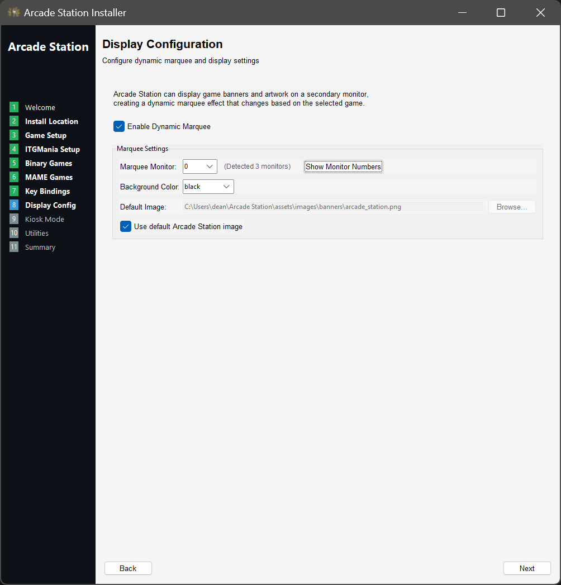

# 🎮 Laptop Setup Guide

## Table of Contents
- [💻 Multi-Monitor Laptop Scenario](#multi-monitor-laptop-scenario)
- [🔧 Multi-Monitor Laptop Installation Walkthrough](#multi-monitor-laptop-installation-walkthrough)
  - [🚀 Launching the Installer](#launching-the-installer)
  - [📁 Choosing Install Directory](#choosing-install-directory)
  - [🎵 Configuring ITGmania](#configuring-itgmania)
  - [💿 Configuring Binary-Based Games](#configuring-binary-based-games)
  - [🕹️ Configuring MAME](#configuring-mame)
  - [⌨️ Configuring Key Bindings and Processes](#configuring-key-bindings-and-processes)
  - [🖼️ Configuring Dynamic Marquee](#configuring-dynamic-marquee)
  - [🔒 Configuring Kiosk Mode](#configuring-kiosk-mode)
  - [🛠️ Configuring Utilities](#configuring-utilities)
  - [📋 Installation Summary](#installation-summary)
- [🎲 A Basic Example Workflow with Arcade Station](#a-basic-example-workflow-with-arcade-station)

### 💻 Multi-Monitor Laptop Scenario

In this example, I'm demonstrating a **portable multi-monitor setup** using a Surface Laptop Studio connected to two external displays. This configuration allows me to:
- Run Arcade Station as the front-end interface
- Manage and launch ITGmania (a rhythm game) and Megatouch Maxx Crown (a touchscreen arcade game)
- Display game banners and song information on a secondary monitor using the dynamic marquee feature

**Why a laptop setup?** This demonstrates Arcade Station's flexibility - you don't need dedicated arcade hardware to create an excellent gaming experience. A laptop with external monitors provides:
- Portability for setting up temporary arcade stations
- Multi-monitor support for dynamic marquee displays
- Full functionality without permanent hardware installation

**Important:** Arcade Station works with virtually any hardware configuration - from laptops to dedicated cabinets to home PCs. This example shows just one approach, but it can be adapted to specific needs, games, and hardware. Whether building a full-size MAME cabinet, a rhythm game station, or just organizing PC games, the same core functionality applies.

### 🔧 Multi-Monitor Laptop Installation Walkthrough

Let's go over where I am as I start this process:
- I'm standing in front of my laptop, logged in as the local Administrator, and have downloaded the latest version of Arcade Station.
- It is a Windows-based PC, currently running Windows 11.
- It has one external monitor connected to it and I'm using an external keyboard and mouse.

#### 🚀 Launching the Installer
1. I'll launch the installer and select `Next`.

   

#### 📁 Choosing Install Directory
2. I'll choose an install location. By default, it wants to install in the logged in users' profile. I'm okay with this and will select `Next`, and then see the files copying to the location.

   

   

3. I'm notified about the different types of games to configure. I'll leave the checkbox checked as I do want to configure my game, Megatouch Maxx, and select `Next`.

   

#### 🎵 Configuring ITGmania
4. I'm asked if I want to use ITGmania. I do, so I'll leave it and select `Next`.
- The installer detected that I have it installed in the default location and is referencing it automatically
- It is set to use a default bundled picture for ITGmania's banner
- It has an option to use the dynamic marquee module which will show songs that I pick on my 2nd display when I pick them, which I'll leave checked

   

#### 💿 Configuring Binary-Based Games
5. I'm asked if I have any binary-based games to configure, which I do (Megatouch Maxx).
- I'll type Megatouch for the name
- I'll select browse and pick the .exe used to open my game
- I'll pick my banner image (the art for the game) that'll show up on the 2nd display. When I click Browse, I see a set of bundled art (which includes Megatouch - otherwise, I'd pick from my PC.)
- I don't have any other games to configure (which I'd do by selecting `Add Another Game`) so I'll select `Next` once done.

   
   
   
   

#### 🕹️ Configuring MAME
6. I'm asked if I want to setup any MAME games. I don't right now, so I'll select `Next`.
- But if I did, I'd check the box, input my `mame.exe` path and `mame.ini` path, then `Add Another MAME-Based Game`, filling it out similarly to how I did the binaries (with the addition of ROMs and save states). 

   

#### ⌨️ Configuring Key Bindings and Processes
7. I'm asked to setup key bindings and processes to kill - very important.
- In the `Key Bindings` tab, there are a set of default key bindings to do things like reset back to the menu, close Arcade Station, and even start streaming.
- If I have any custom scripts or apps I want to run with a button press, I can add them here.
- The main one for me is `Reset back to menu` (which closes the games and brings me back) which will get triggered if I click `Ctrl + Space`. 
- I'm happy with these bindings for now, so I'll leave them - but I can add, edit, or remove as needed.

   

8. Near the top, there's a `Process Management` tab. This is the list of processes to close when resetting back to the menu or exiting Arcade Station. 
- Since I'm adding Megatouch, I need to add the processes it launches to make sure they get closed.
- I added the list to the top and selected `Next`, leaving everything else.

   
   

#### 🖼️ Configuring Dynamic Marquee
9. I'm asked about setting up my display. This is for a dynamic marquee, or a "billboard" of sorts that shows the art for the game I pick.
- I click `Show Monitor Numbers` which shows a little number on each of my display, so I know which is identified as what for the system.
- I want it on my right screen (or `Monitor 1` for Arcade Station's sake), so I'll select it.
- I can choose the background color, since the dynamic marquee supports transparent .png files. I'm happy with `Black` so I'll leave it.
- I can also change the default menu image here if I want for when I'm in the menu. I'm happy with the default, so I'll leave it checked and will select `Next`.

   
   

#### 🔒 Configuring Kiosk Mode
10. I'm asked about setting up Kiosk Mode, which would turn my computer into a purpose built station (when I turn it on, it'll auto-login and start arcade station - nothing else). Since this is just my portable machine, I won't. But if I were to, I'd check the box to `Enable Kiosk Mode` and input the credentials to automatically logon with. I'll select `Next`.

    

#### 🛠️ Configuring Utilities
11. I'm asked about utilities to setup:
- There's a light reset program option, which lets me pick my light controller if I want to reset them between game selections
- There's a VPN client setting, which lets me pick my VPN client and configuration file for autoconnecting when the system turns on
- There's a streaming setting, so that I can pick my streaming program like OBS to have it auto-started on a button press from the key bindings earlier
- By default, the installer includes an audio app that is used to show volume controls in kiosk mode whenever it's used
- It also gives an option to save screenshots to a folder, which will map to a button press from the key bindings earlier
- I'll leave this all as default and select `Next`. 

   

#### 📋 Installation Summary
12. I'll be shown my summary, which will include all of the settings I picked. When ready, I'll select `Finish` and will receive a confirmation dialog, prompting me to launch it for the first time if I setup kiosk mode for any security prompts.

    

    

13. My install directory will open and I'll get a final confirmation box. Arcade Station is installed!

    

    

### 🎲 A Basic Example Workflow with Arcade Station

1. I'll right-click `launch_arcade_station.bat` and run it as administrator to start Arcade Station. If I set kiosk mode up, after this, I'd reboot.

2. Arcade Station will launch, showing the menu on my main screen and my `dynamic marquee` on my 2nd monitor (`Monitor 1` from the setup).
- I see ITGmania and Megatouch! I'd like to play some Megatouch now, so I'll select it either by clicking or by using the arrow key and pressing `Enter`.

   

3. After launching Megatouch, it launches the game. It's quite fun.
- The dynamic marquee changed to the banner image for Megatouch set in the installer.
- Once I'm done, I'll use the reset to menu key binding (by default, `Ctrl + Space`) which will close all programs (including the processes I added for Megatouch), closing the game and getting me back to the menu.

   

   

4. Once I'm done, I'll use the reset to menu key binding (by default, `Ctrl + Space`) which will close all programs (including the processes I added for Megatouch), closing the game and getting me back to the menu.

   

5. Now I'd like to play ITGmania, so I'll do the same thing - pick the entry and launch it.
- The dynamic marquee changed to the banner image for ITGmania and boots into the game.

   

6. I'm going to play the song Kiss Me Red, classic song.
- Because I enabled the Simply Love dynamic marquee module, the banner changes to the song art for Kiss Me Red.
- Once the song ends and I go back to the song selection menu, the ITGmania banner gets set back.

   
   

7. I've had a great time today, and now that I'm done, I want to close Arcade Station. I do that with the default key binding of (`Ctrl + F10`.)